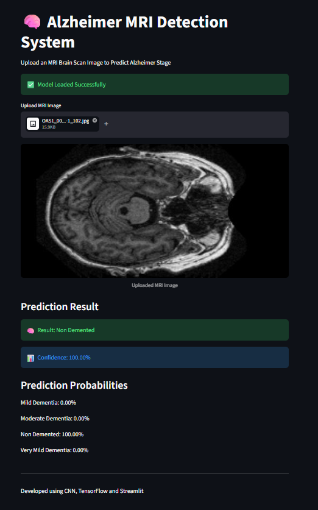
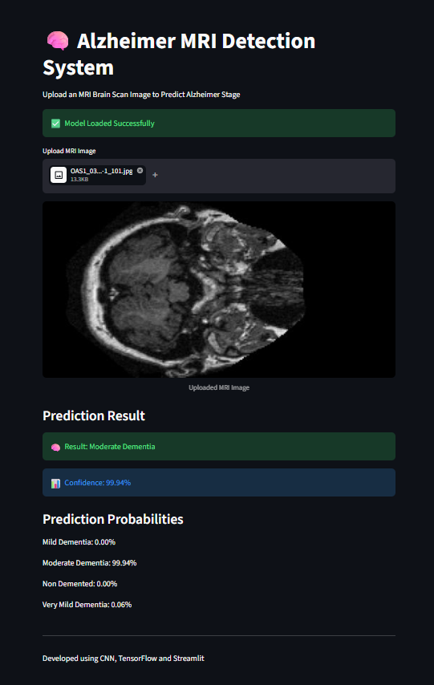

# 🧠 Alzheimer Disease Detection using CNN

## 📖 Project Overview

Alzheimer's Disease Detection using Convolutional Neural Networks (CNN) is an Artificial Intelligence and Deep Learning-based healthcare application designed to assist in the early diagnosis of Alzheimer's disease from brain MRI images.

The system automatically analyzes MRI scans, extracts important image features using deep learning techniques, and classifies patients into different stages of Alzheimer's disease. Early detection helps healthcare professionals provide timely treatment, monitor disease progression, and improve patient care.

This project utilizes Convolutional Neural Networks (CNN) implemented with TensorFlow and Keras to achieve accurate image classification. The application includes a user-friendly web interface built with Streamlit, enabling users to upload MRI images and receive instant predictions.

---

# 🎯 Objectives

- Detect Alzheimer's disease from MRI brain images.
- Assist doctors with AI-supported diagnosis.
- Reduce manual interpretation time.
- Improve early-stage disease identification.
- Provide a simple and interactive prediction interface.

---

# 🏥 Problem Statement

Alzheimer's disease is a progressive neurological disorder that affects memory, thinking ability, and cognitive functions. Traditional diagnosis relies on expert analysis of MRI scans, which can be time-consuming and subjective.

This project automates the diagnosis process using Deep Learning, providing fast, consistent, and reliable predictions from MRI images.

---

# 💡 Proposed Solution

The system uses a trained Convolutional Neural Network (CNN) model to classify MRI brain images into Alzheimer's disease categories.

The application performs:

- MRI Image Upload
- Image Preprocessing
- Feature Extraction
- CNN-based Classification
- Disease Prediction
- Display of Prediction Results

---

# ⚙️ Working Process

## Step 1: MRI Image Upload

The user uploads a brain MRI image through the Streamlit web application.

↓

## Step 2: Image Preprocessing

The uploaded MRI image is preprocessed by:

- Resizing to model input dimensions
- Normalizing pixel values
- Removing unnecessary image variations
- Converting image into numerical arrays

↓

## Step 3: Feature Extraction

The CNN automatically extracts important brain features including:

- Texture
- Shape
- Brain tissue patterns
- Cortical structure
- Hippocampus region characteristics

Unlike traditional machine learning, feature extraction is performed automatically by convolutional layers.

↓

## Step 4: CNN Prediction

The processed image is passed through multiple CNN layers:

- Convolution Layer
- ReLU Activation
- Max Pooling
- Dropout Layer
- Fully Connected Layer
- Softmax Output Layer

The network analyzes the MRI image and predicts the Alzheimer's stage.

↓

## Step 5: Disease Classification

The model classifies the MRI image into one of the following categories:

- Non Demented
- Very Mild Demented
- Mild Demented
- Moderate Demented

↓

## Step 6: Result Display

The predicted Alzheimer's stage and confidence score are displayed on the Streamlit dashboard.


The following screenshots show the prediction results generated by the Alzheimer's Disease Detection system.

### Non-Demented


**Prediction:** Non-Demented

---

### Very Mild Demented


**Prediction:** Very Mild Demented

---

### Moderate Demented


**Prediction:** Moderate Dementated

---

# 🧠 CNN Architecture

The Convolutional Neural Network consists of:

- Input Layer
- Convolution Layers
- ReLU Activation
- Max Pooling Layers
- Dropout Layers
- Flatten Layer
- Dense Layers
- Softmax Output Layer

The model learns important image features automatically during training.

---

# 🔄 System Workflow

```
MRI Image
      │
      ▼
Image Upload
      │
      ▼
Preprocessing
      │
      ▼
Feature Extraction
      │
      ▼
CNN Model
      │
      ▼
Classification
      │
      ▼
Prediction Result
      │
      ▼
Streamlit Dashboard
```

---

# 📂 Project Structure

```
Alzheimer_Detection/
│
├── dataset/
│
├── models/
│   └── alzheimer_model.h5
│
├── images/
│
├── app.py
├── train_model.py
├── predict.py
├── requirements.txt
├── README.md
│
└── notebooks/
```

---

# 🛠️ Technologies Used

- Python
- TensorFlow
- Keras
- OpenCV
- NumPy
- Pandas
- Matplotlib
- Streamlit
- Scikit-learn

---

# 📊 Dataset

The project uses MRI brain images collected from publicly available Alzheimer's disease datasets.

The dataset contains four categories:

- Non Demented
- Very Mild Demented
- Mild Demented
- Moderate Demented

Images are preprocessed before training to improve model performance.

---

# 🚀 Features

- Deep Learning-based prediction
- Automatic MRI image classification
- High prediction accuracy
- User-friendly Streamlit interface
- Fast diagnosis
- Real-time prediction
- Easy deployment
- Scalable architecture

---

# 🎯 Advantages

- Early detection of Alzheimer's disease
- Reduces manual diagnosis effort
- Supports healthcare professionals
- High classification accuracy
- Automated feature extraction
- Cost-effective AI solution
- Easy to use

---

# 📈 Future Enhancements

- Deploy on cloud platforms
- Mobile application support
- Multi-disease brain MRI detection
- Explainable AI (Grad-CAM visualization)
- Integration with hospital information systems
- Patient history management
- Real-time clinical deployment

---

# 📚 Applications

- Hospitals
- Diagnostic Centers
- Medical Research
- Healthcare Analytics
- Clinical Decision Support Systems
- AI-assisted Medical Imaging

---

# 👨‍💻 Author

**Sri Harish**

B.E. Computer Science and Engineering

Research Area: Artificial Intelligence, Deep Learning, Medical Image Analysis, Data Analytics

